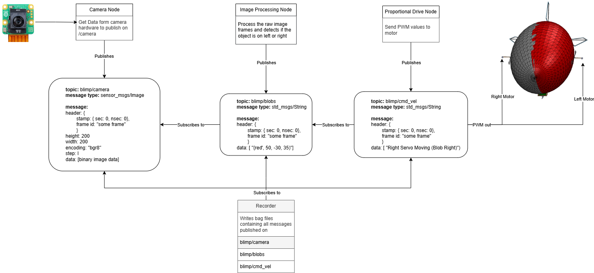

# Team Assignment 2  

### Authors:  
**Nihar Masurkar, Prajjwal Dutta, & Sai Srinivas Tatwik Meesala**  

## Overview  
As the final project revolves around the **BLIMP** structure, we have adapted the assignment workflow to utilize hardware compatible with the BLIMP rather than the components initially designed for the **TurtleBot4**.  

## Hardware Modifications  
- **Camera System:** Replaced the **Oak-D Stereo Camera** with a **Raspberry Pi Camera**.  
- **Motor System:** Substituted the **TurtleBot4's motor driver and motors** with **servo motors**, which function as propellers for the BLIMP.  

## System Setup Workflow  
Below is the general flow of how everything is set up:  
  

## Submission Contents  
The provided ZIP file includes:  
- **blimps_project package**: Contains the necessary launch file, as well as detailed message and node descriptions relevant to this assignment.  
- **Deliverables folder**: Includes the **ROS bag files** along with a **video demonstration** showcasing the completion of the assigned task.  

## Usage Instructions  
1. Extract the provided ZIP file.  
2. Navigate to the **blimps_project** directory and review the launch files and message descriptions.  
3. Use the **Deliverables folder** to access ROS bag files and the task demonstration video.  

